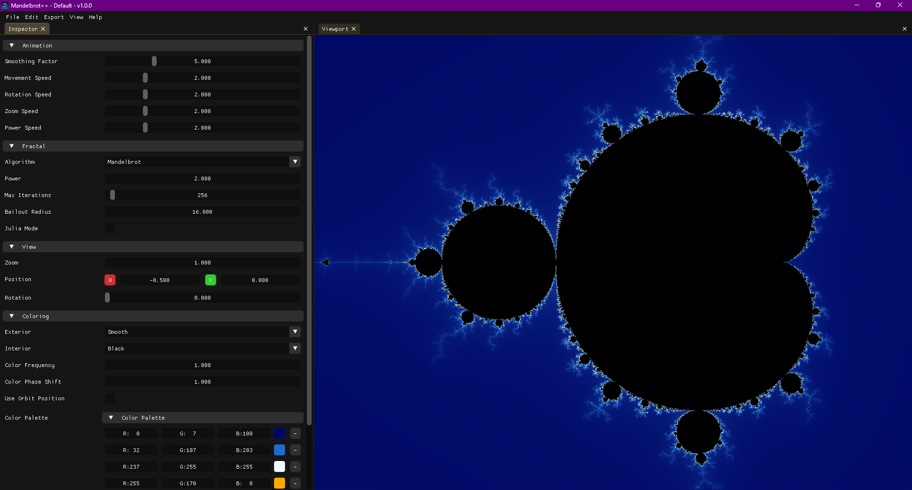
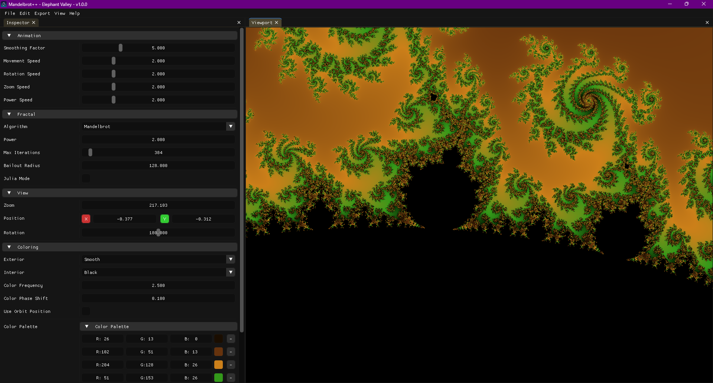
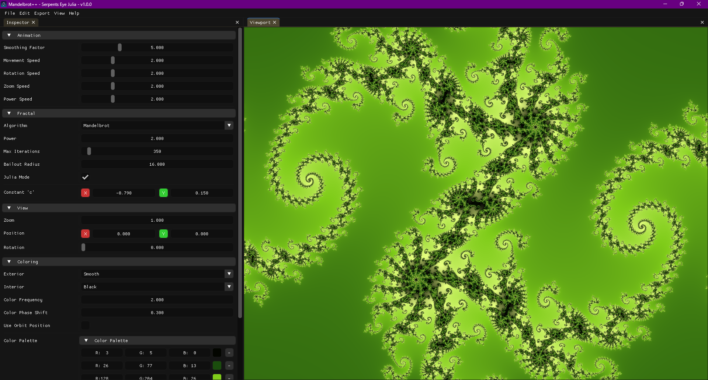
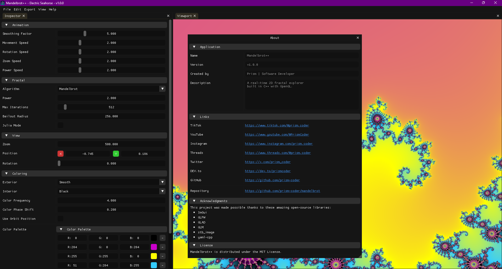
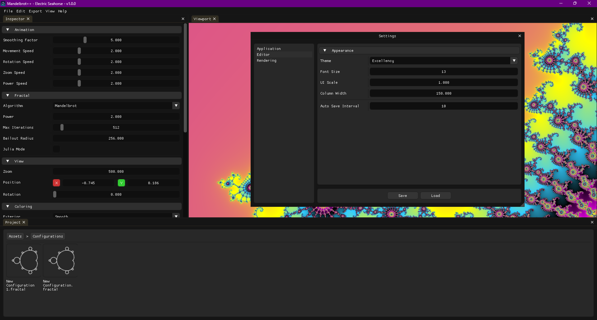

# Mandelbrot++

A high-performance, interactive Mandelbrot set explorer built with C++ and OpenGL. This application provides a comprehensive GUI for visualizing and exploring the intricate beauty of fractal mathematics, featuring real-time rendering, customizable parameters, and a vast collection of presets.

## Features

### Core Functionality
- **Real-time Fractal Rendering**: GPU-accelerated rendering using OpenGL shaders for smooth, high-performance visualization
- **Multiple Fractal Algorithms**: Support for Mandelbrot, Burning Ship, and Tricorn fractals
- **Julia Set Mode**: Interactive exploration of Julia sets with customizable parameters
- **High Precision**: Support for arbitrary power values and detailed iteration control

### Visualization Options
- **Coloring Algorithms**:
  - Step coloring for classic banded appearance
  - Smooth coloring for continuous gradients
  - Distance estimation for enhanced detail and lighting effects
- **Color Palettes**: Extensive collection of predefined palettes with customizable frequency and offset
- **Orbit Coloring**: Angle-based coloring for additional visual complexity
- **Orbit Traps**: Various geometric shapes (points, circles, lines, boxes, crosses) for creative effects

### User Interface
- **ImGui-based GUI**: Modern, customizable interface with docking support
- **Multiple Windows**:
  - Inspector: Real-time parameter adjustment
  - Viewport: Main fractal display
  - Project: Configuration management
  - Statistics: Performance monitoring
  - Settings: Application configuration
  - About: Application information
- **Theme Support**: 40+ built-in themes for UI customization

### Configuration Management
- **Preset System**: Hundreds of curated fractal configurations organized by categories:
  - Algorithmic Variations
  - Artistic & Technical Showcase
  - Julia's Realm
  - Multibrot & Abstract
  - The Classics
- **Save/Load Configurations**: YAML-based configuration files for sharing and backup
- **Recent Files**: Quick access to recently opened configurations

### Export Capabilities
- **Image Export**: Save high-resolution fractal images in various formats
- **Configuration Export**: Share custom fractal parameters

## Technical Details

### Architecture
- **Language**: C++20
- **Graphics API**: OpenGL 4.6 with GLAD loader
- **Windowing**: GLFW
- **GUI**: Dear ImGui
- **Math Library**: GLM (OpenGL Mathematics)
- **Serialization**: YAML-CPP
- **Image Handling**: stb_image
- **Build System**: Premake 5

### Performance Features
- **GPU Acceleration**: All fractal computation performed on GPU via shaders
- **Smooth Interpolation**: Exponential interpolation for parameter changes
- **Multithreaded Building**: Parallel compilation support
- **Optimized Rendering**: Efficient OpenGL state management

### Platform Support
- **Primary Platform**: Windows (x64)
- **Build Configurations**:
  - Debug: Full debugging symbols
  - Release: Optimized with symbols
  - Dist: Optimized without symbols, windowed app

## Building and Running

### Prerequisites
- **Windows 10/11**
- **Visual Studio 2022** with C++ development tools
- **Git** for submodule management

### Setup
1. Clone the repository with submodules:
   ```bash
   git clone --recursive https://github.com/prism-coder/mandelbrot
   cd mandelbrot
   ```

2. Run the setup script:
   ```bash
   # Windows VS2026:
   Scripts/Setup/Windows-vs2026.bat

   # Windows VS2022:
   Scripts/Setup/Windows-vs2022.bat
   ```

3. Build the project:
   ```
   Open Mandelbrot.sln(x) in Visual Studio and build
   ```

4. Run the application:
   ```
   bin/Release-windows-x86_64/Mandelbrot/Mandelbrot.exe
   ```

### Dependencies
The project uses git submodules for external dependencies:
- **GLFW**: Window and input management
- **GLAD**: OpenGL function loading
- **ImGui**: GUI framework
- **GLM**: Mathematics library
- **YAML-CPP**: Configuration serialization
- **stb**: Image loading utilities

## Usage

### Basic Navigation
- **Zoom**: Mouse wheel or UI controls
- **Pan**: Click and drag in viewport
- **Rotate**: Shift + drag or rotation controls
- **Reset View**: Double-click or reset button

### Parameter Adjustment
- Use the Inspector window to modify fractal parameters in real-time
- Adjust power, bailout radius, iteration count, and coloring options
- Enable Julia mode to explore Julia sets

### Working with Configurations
- Load presets from the Project window
- Save custom configurations for later use
- Export high-resolution images of your creations
- Export the current fractal configuration

### Customization
- Choose from 40+ UI themes in Settings
- Adjust font size, UI scale, and layout
- Configure rendering resolution and performance options

## Configuration File Format

Configurations are stored in YAML format with the following structure:

```yaml
Mandelbrot:
  FractalParameters:
    Algorithm: Mandelbrot # Mandelbrot, Burning Ship, Tricorn
    Power: 2.0
    Bailout: 16.0
    MaxIterations: 256
  ViewParameters:
    Zoom: 1.0
    Position: [-0.5, 0.0]
    Rotation: 0.0
  JuliaParameters:
    JuliaMode: false
    JuliaC: [-0.8, 0.156]
  ColoringParameters:
    ExteriorColoring: Smooth # Step, Smooth, DistanceEstimation
    InteriorColoring: Black # Black, White, CustomColor
    InteriorColor: [0.0, 0.0, 0.0]
    ColorFrequency: 1.0
    ColorOffset: 0.0
    OrbitColoring: false
    DistanceScale: 50.0
    ColorPalette:
      Colors: 
        - [0.0, 0.0, 0.0]
        - [1.0, 0.0, 0.0]
        - [1.0, 1.0, 0.0]
        - [0.0, 1.0, 0.0]
  OrbitTrap:
    Type: None # None, Point, Circle, Line, Box, Cross
    P1: [0.0, 0.0]
    P2: [0.0, 0.0]
    Color: [1.0, 1.0, 1.0]
    Blend: 0.5
```

## Contributing

Contributions are welcome! Please feel free to submit pull requests, report issues, or suggest new features.

### Development Setup
1. Follow the building instructions above
2. Use the Debug configuration for development
3. Enable logging in settings for debugging

### Code Style
- Use C++20 features where appropriate
- Follow the existing naming conventions
- Document complex algorithms and shaders
- Maintain separation between core engine and application logic

## License

This project is licensed under the MIT License - see the [LICENSE](LICENSE) file for details.

## Acknowledgments

- **Mathematical Foundation**: Based on the work of Benoît Mandelbrot and other mathematicians in fractal geometry
- **Libraries**: Thanks to the developers of GLFW, ImGui, GLM, and other dependencies
- **Community**: Inspired by various fractal exploration tools and research

## Screenshots











---

**Note**: This application requires a modern GPU with OpenGL 4.6 support for optimal performance. Integrated graphics may experience reduced frame rates with high iteration counts.
